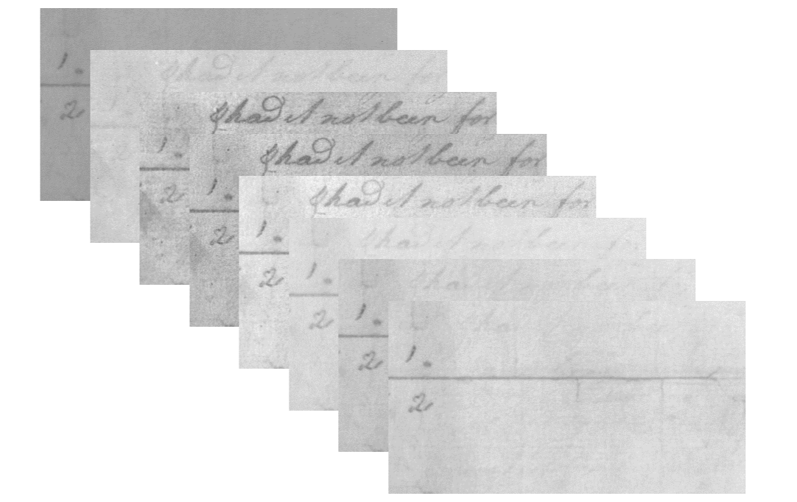
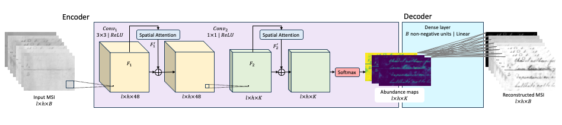

# Attention-based AE Orthogonal NMF for Multispectral Image Decomposition

> Blind spectral unmixing of historical manuscript images using a hybrid CNN Autoencoder + NMF architecture with visual attention and orthogonality constraints.

---

## Overview

Ancient manuscripts are a uniquely hard decomposition problem: multiple ink layers, paper ageing, and physical degradation all overlap in the same pixels, across multiple spectral bands. Standard NMF ignores spatial structure. Standard deep learning ignores physical non-negativity constraints.

**VNAE-ONMF** (Visual-attention Network Autoencoder - Orthogonal NMF) bridges both worlds:

- A **convolutional encoder** captures local spatial patterns and spectral non-linearities
- A **Large-Kernel Attention** (LKA) module focuses the model on spatially informative regions
- A **fully-connected NMF decoder** with non-negativity constraints produces physically interpretable endmember spectra
- An **orthogonality loss** on the abundance maps forces separated components to be linearly independent, each ink, paper layer, or degradation artefact ends up in its own component

The result: **state-of-the-art text extraction on real-world multispectral document benchmarks**, with a decoder that uses only `m × k` parameters (32 parameters for 8 bands / 4 components), a **50% total model size reduction** compared to traditional AE-NMF decoders.

Training is fully **self-supervised**: the only signal is the reconstruction of the input spectral cube; no pixel-level annotations or abundance map ground truth are required.

---

## The Problem

<!-- INSERT: side-by-side comparison of a raw multispectral input (a few bands) and the expected decomposition output (abundance maps for paper / text / degradation) -->
<!-- Suggested caption: "Input: 8-band MS image of a degraded 17th-century manuscript. Output: separated abundance maps for paper, two ink layers, and degradation." -->

Multispectral (MS) images of historical documents are captured across 8–12 spectral bands spanning UV to near-infrared (340–1100 nm). Each pixel contains a mixture of spectral signatures from, typically :

- **Paper background** (possibly torn or discoloured)
- **Primary ink layer** (the main text)
- **Secondary ink layer(s)** (lined rulings, stamps, stains)
- **Degradation** (fading, physical damage)

Each of these elements has a distinct **spectral signature**: they appear or disappear depending on the wavelength. Sources respond differently across the 8–12 bands, and that variability is what makes blind separation physically grounded, even without annotations.

Recovering each source from the mixed pixel observations, with no prior knowledge of spectral signatures or mixture coefficients, is a **blind source separation** problem. Non-linear spectral interactions, high spatial correlations, and severe degradation make it particularly challenging.

---

## Architecture

VNAE-ONMF pipeline: CNN encoder → Abundance Maps → FC decoder (endmember matrix)

---

## Results

All experiments use Howe's binarization as a post-processing step. Results are averaged over the respective test sets.

### MSTEx-2 (30 historical manuscripts, 8 bands, 340–1100 nm)

| Method | FM (%) ↑ | DRD (×10⁻²) ↓ | NRM (×10⁻²) ↓ | PSNR ↑ |
| --- | --- | --- | --- | --- |
| Howe | 70.41 | 8.58 | 12.06 | 15.03 |
| SKKHM | 62.68 | 17.16 | 16.33 | 13.29 |
| GMM | 82.05 | 4.54 | 8.67 | 16.97 |
| MA-ONMF | 83.86 | 3.72 | 8.92 | — |
| **VNAE-ONMF (ours)** | **84.29** | **3.58** | **7.67** | **21.33** |

### MSTEx-1

| Method | FM (%) ↑ | DRD (×10⁻²) ↓ | NRM (×10⁻²) ↓ | PSNR ↑ |
| --- | --- | --- | --- | --- |
| Howe | 81.83 | 6.34 | 5.23 | 15.07 |
| SKKHM | 79.86 | 5.48 | 10.34 | 15.37 |
| GMM | 79.82 | 5.52 | 11.61 | 15.42 |
| MA-ONMF | **86.32** | **3.46** | **6.11** | - |
| **VNAE-ONMF (ours)** | 85.42 | 3.75 | 6.58 | **17.39** |

### MSBin (severely degraded manuscripts, 12 bands, 365–940 nm)

Evaluated on Book BT (Bitola-Triodion) and Book EA (Enina-Apostolus, severely degraded). VNAE-ONMF outperforms baselines in PSNR, although its performance declines in other metrics.

### Model efficiency

| Component | Parameters | Size |
| --- | --- | --- |
| Encoder (with attention) | 12,324 | 48.14 KB |
| Decoder | **32** | 0.13 KB |
| **Total** | **12,356** | **48.27 KB** |

The decoder uses only `m × k` weights (spectral bands × number of components). At 8 bands and 4 components, that is **32 parameters**, a 50% reduction in total parameter count compared to standard AE-NMF decoders.

---

## Datasets

The experiments use three public benchmarks for multispectral document text extraction:

| Dataset | Images | Bands | Wavelength | Resolution | Source |
| --- | --- | --- | --- | --- | --- |
| MSTEx-1 | 30 | 8 | 340–1100 nm | 6 MP | ICDAR 2015 |
| MSTEx-2 | 30 | 8 | 340–1100 nm | 6 MP | ICDAR 2015 |
| MSBin | — | 12 | 365–940 nm | 60 MP | [Zenodo](https://doi.org/10.5281/zenodo.3257365) |

---

## Requirements

The used libraries are listed in `requirements.txt`.

---

## Paper

**Attention-based Autoencoder-like Orthogonal NMF for Multispectral Image Decomposition**
Thomas Olive, Abderrahmane Rahiche, Mohamed Cheriet
*Synchromedia Lab, École de Technologie Supérieure (ETS), Montreal, Canada*

Submitted to ICASSP 2025 — IEEE International Conference on Acoustics, Speech and Signal Processing.

---

## Acknowledgements

The authors thank the Synchromedia Lab for providing the computational resources and expertise that made this research possible.
